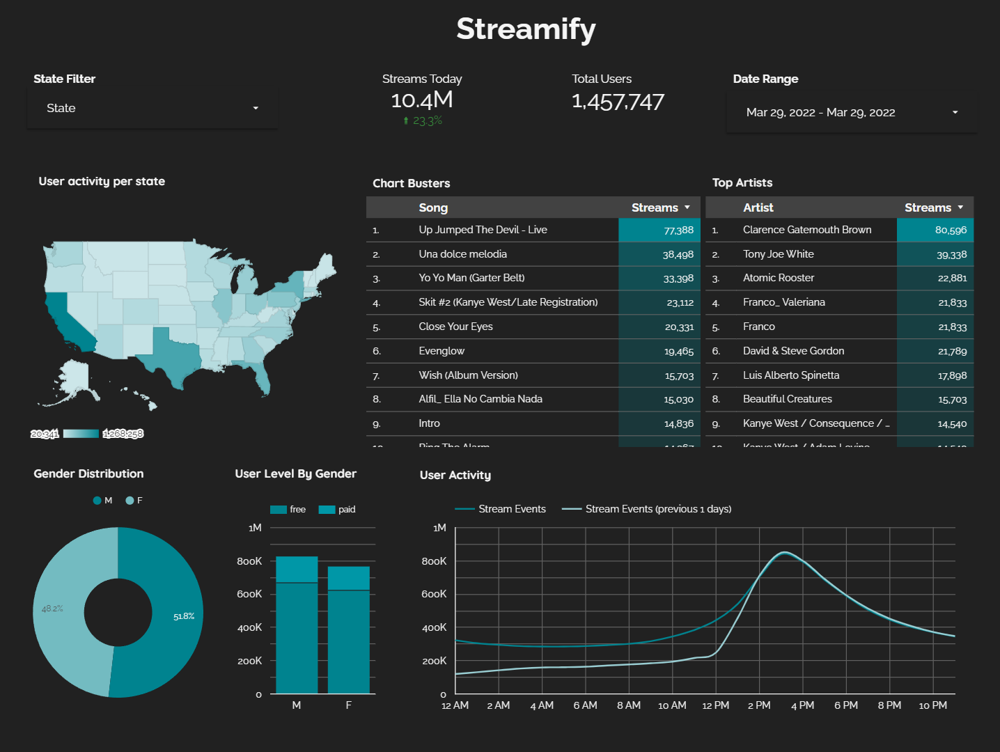

# Symphony Stream: Real-Time Music Analytics Pipeline 🚀

Dive into the world of real-time data engineering with a Spotify-like data pipeline! Harness the power of Kafka, Spark Streaming, dbt, Docker, Airflow, Terraform, GCP, and more!

## 🎯 Project Objective

Imagine you're running the next big music streaming service. How do you handle the flood of user data? That's where Symphony Stream comes in! We're building a data pipeline that:

- Streams events from a simulated music service 🎧
- Processes real-time data on user activity 👥
- Stores data in a data lake every 2 minutes ⏱️
- Runs hourly batch jobs for transformations 🔄
- Creates analytics-ready tables for insightful dashboards 📊

Curious about popular songs, active users, or user demographics? We've got you covered!

## 🎼 Dataset: The Beat of Our Project

We're using [Eventsim](https://github.com/Interana/eventsim) - a cool program that generates event data mimicking a music website. It's like having a virtual music festival at your fingertips! 

- Data source: [viirya's Eventsim fork](https://github.com/viirya/eventsim) (Because even data needs a remix sometimes!)
- Song data: [Million Songs Dataset](http://millionsongdataset.com) (We're using a [subset](http://millionsongdataset.com/pages/getting-dataset/#subset) of 10,000 songs to keep things groovy)

## 🛠️ Tech Stack:

- Cloud Virtuoso: [**Google Cloud Platform**](https://cloud.google.com)
- Infrastructure Composer: [**Terraform**](https://www.terraform.io)
- Containerization Maestros: [**Docker**](https://www.docker.com) & [**Docker Compose**](https://docs.docker.com/compose/)
- Stream Processing Duo: [**Kafka**](https://kafka.apache.org) & [**Spark Streaming**](https://spark.apache.org/docs/latest/streaming-programming-guide.html)
- Orchestration Conductor: [**Airflow**](https://airflow.apache.org)
- Transformation Artist: [**dbt**](https://www.getdbt.com)
- Data Lake Lifeguard: [**Google Cloud Storage**](https://cloud.google.com/storage)
- Data Warehouse Architect: [**BigQuery**](https://cloud.google.com/bigquery)
- Visualization Virtuoso: [**Data Studio**](https://datastudio.google.com/overview)
- Language of Choice: [**Python**](https://www.python.org) 🐍

## Architecture:

## Dashboard:

## 🚀 Ready to Rock? Let's Set This Up!

**⚠️ Warning: GCP will charge you for this infrastructure. New users get a $300 credit - use it wisely!**

### 🎬 Pre-show Setup

Already a GCP and Terraform pro? Skip to the main event! For the rest:

1. **Google Cloud Platform**: 
   - [GCP Account and Access Setup](setup/gcp.md)
   - [gcloud for Windows (alternative method)](https://github.com/DataTalksClub/data-engineering-zoomcamp/blob/main/week_1_basics_n_setup/1_terraform_gcp/windows.md#google-cloud-sdk)
2. **Terraform**: 
   - [Terraform Setup Guide](https://github.com/DataTalksClub/data-engineering-zoomcamp/blob/main/week_1_basics_n_setup/1_terraform_gcp/windows.md#terraform)

### 🎉 The Main Event

1. Set the stage with GCP infrastructure: [Terraform Setup](setup/terraform.md)
2. (Bonus Track) SSH into VMs & Port Forwarding: [SSH Guide](setup/ssh.md)
3. Kick off the Kafka beat: [Kafka & Eventsim Setup](setup/kafka.md)
4. Light up the Spark cluster: [Spark Streaming Setup](setup/spark.md)
5. Let Airflow conduct the orchestra: [Airflow Setup](setup/airflow.md)

### 🎵 Hitting a Sour Note?

Check out our [Troubleshooting Guide](setup/debug.md) to get back in tune!

## 🚀 Future Encores

The show's not over! Here's how we could amp it up:

- Embrace managed services (Cloud Composer, Confluent Cloud)
- Craft a custom VPC network
- Build dimensions and facts incrementally
- Compose data quality tests
- Expand dimensional models
- Introduce CI/CD
- Crank up the visualizations

## 🙌 Standing Ovation

A big shoutout to [DataTalks.Club](https://datatalks.club) for their free Data Engineering masterclass. This project is powered by their teachings! Want to join the band? Check out their [course](https://github.com/DataTalksClub/data-engineering-zoomcamp) and start your own data engineering journey! 🎸🥁🎹

Ready to make some noise in the data world? Let's rock this pipeline! 🤘